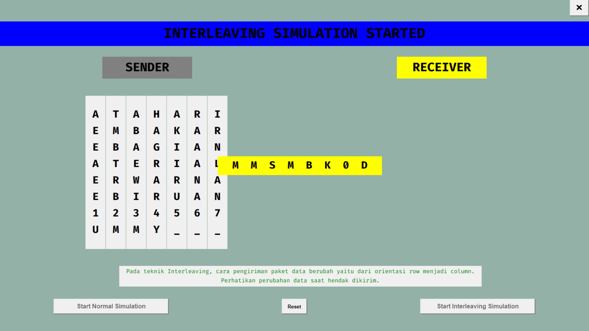

# Interleaving Simulator Application using Python tkinter





## How to run without Python
1. Download this repository (zip)
2. Extract the file you've already downloaded
3. Go to `ouput` folder
4. Go to `Interleaving Simulator` folder
5. Finally, run the `Interleaving Simulator.exe`

> Keep in mind, if you want to move to other folder, make sure to move all inside `Interleaving Simulator` folder. Otherwise, the program won't run.


## Activate Python virtual environement
```bash
venv\Scripts\activate
```


## Python library requirement
```bash
pip install tkinter
pip install pyinstaller
pip install auto-py-to-exe
```


## How to compile `.py` to `.exe` file (pyinstaller)
```bash
# Compile normal
pyinstaller main.py

# Compile with no terminal
pyinstaller main.py --windowed

# Compile into single file and no terminal
pyinstaller main.py --onefile --windowed

# Compile into single file, no terminal, and set icon app
pyinstaller main.py --onefile --windowed --icon="assets\interleaving app.ico"

# Compile into single file, no terminal, set icon app, and set name for the app after compiled
pyinstaller main.py --onefile --windowed --icon="assets\interleaving app.ico" --name="Interleaving Simulator"
```


## How to compile `.py` to `.exe` file (auto-py-to-exe)
In this project, I compiled it using `auto-py-to-exe`. For detail om how to compile using this library, you can check tutorial on YouTube. 

Link below:<br>
https://youtu.be/Y0HN9tdLuJo?si=qW8ea1cufsxni90u

```bash
auto-py-to-exe
```
